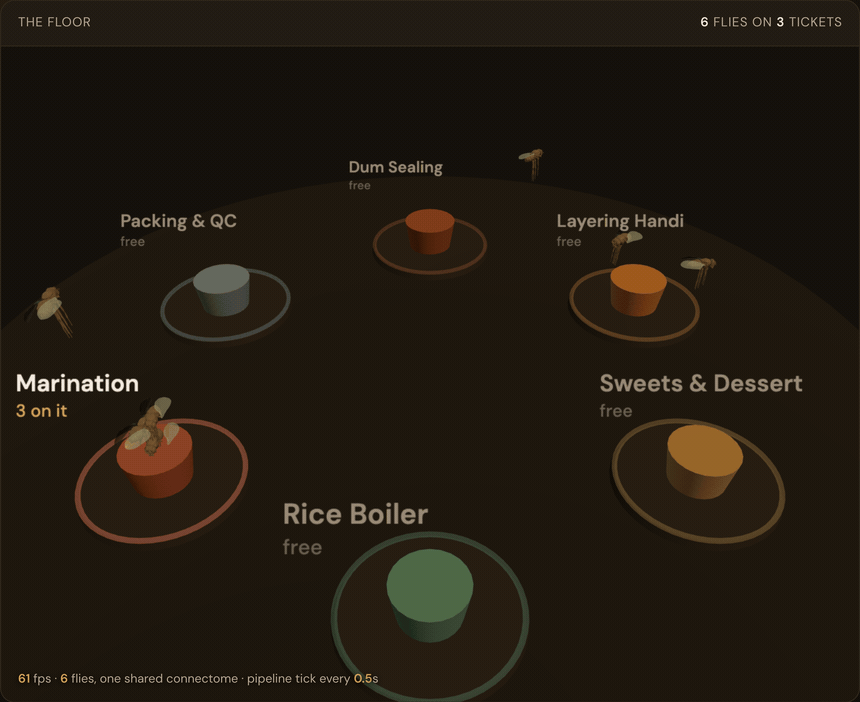
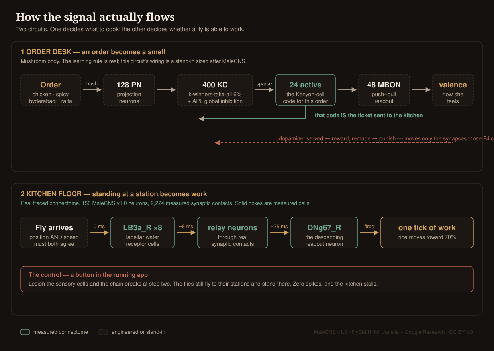
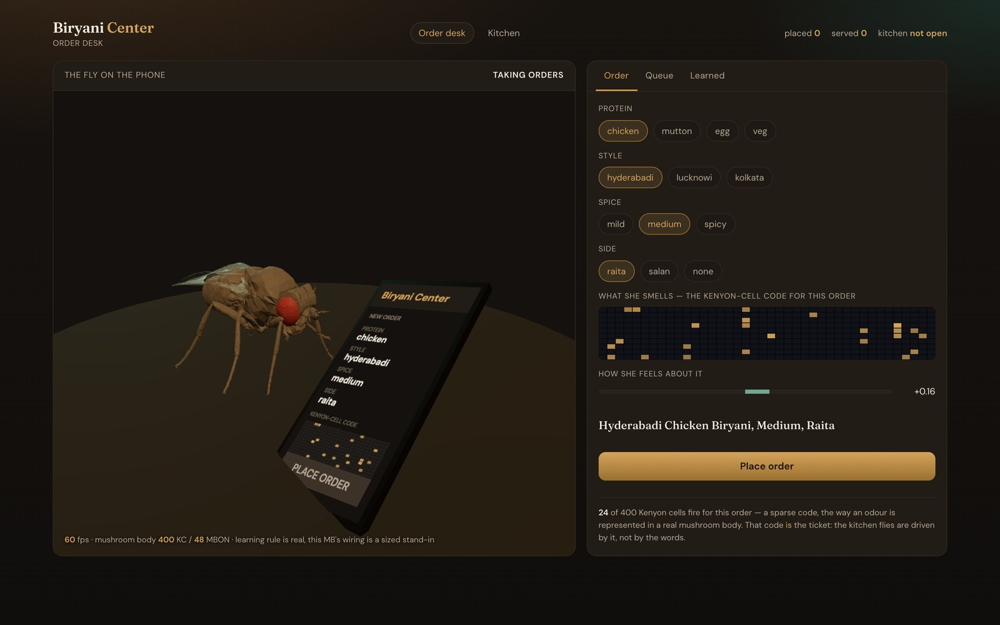
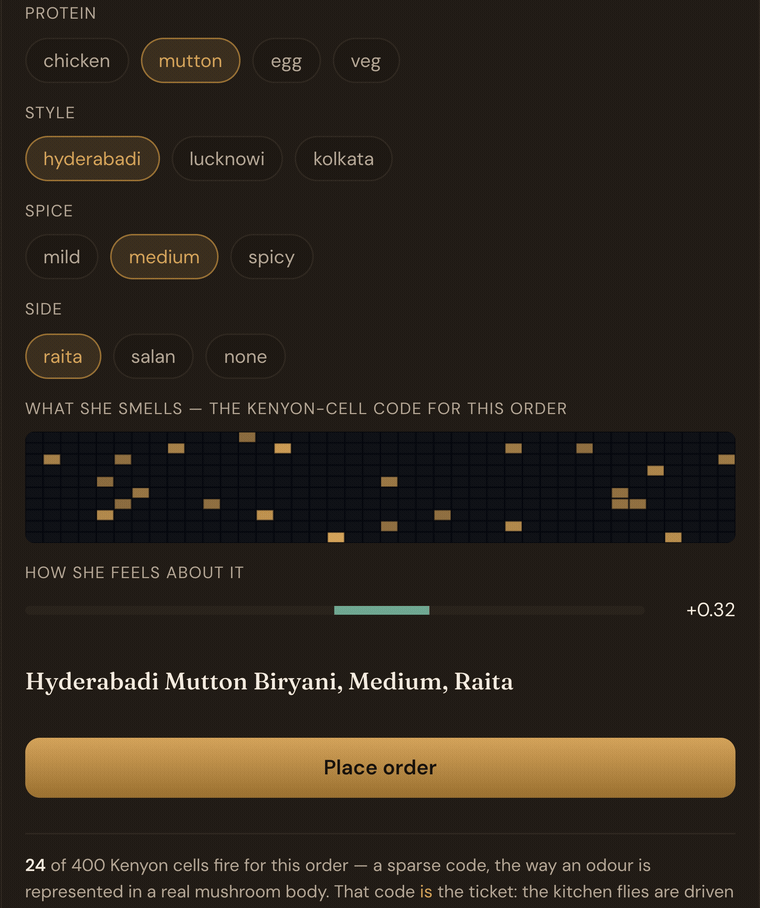
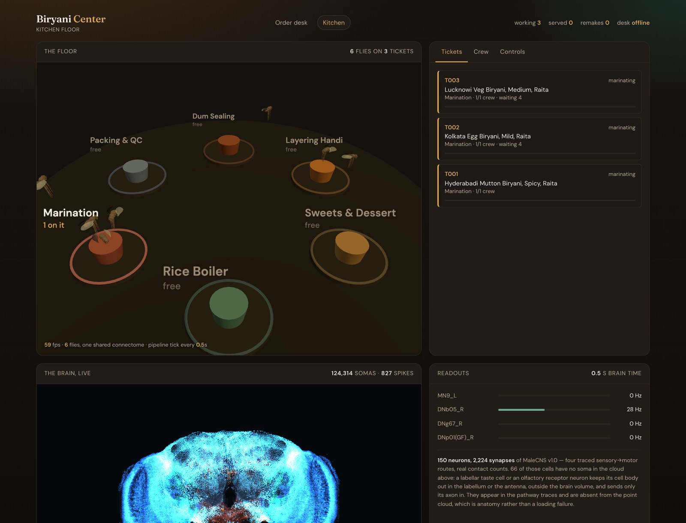
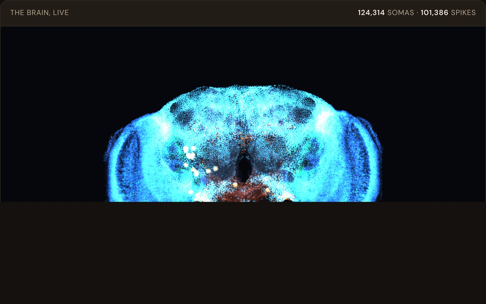
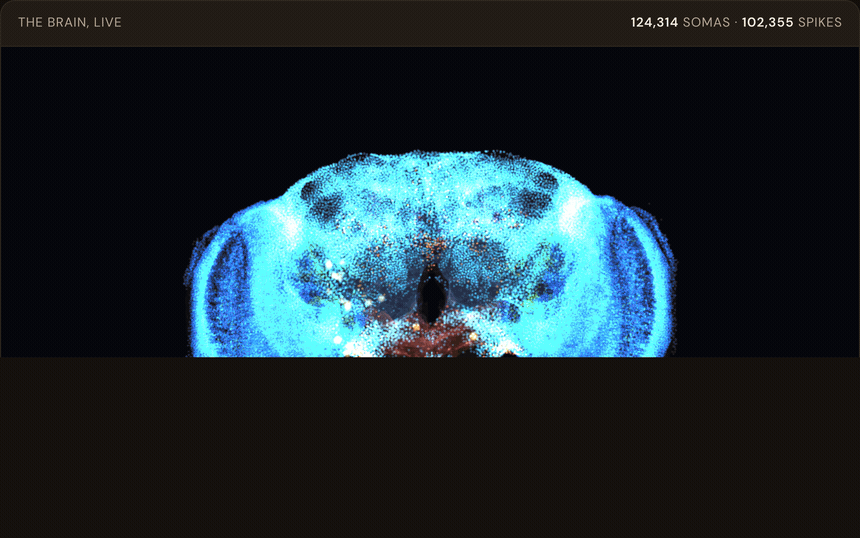
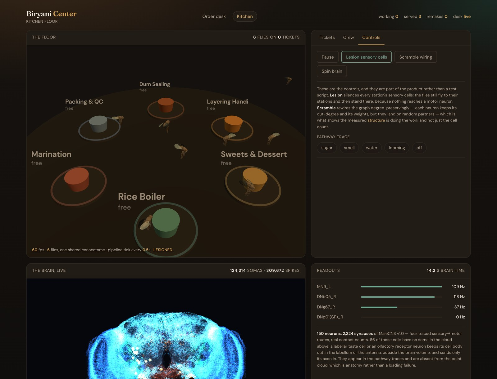

# Fly Biryani

**A fruit-fly biryani restaurant, run by a real *Drosophila* connectome in your browser.**

Flies take orders on a phone, then cook a Dum Biryani across six kitchen stations — and every
tick of work is gated by an actual fly brain, simulated live from Janelia's MaleCNS v1.0
connectome.



```bash
cd Mainproject && python3 serve.py
```

Open **http://localhost:8080/orders.html**, build an order, then click **Kitchen** to watch it
get cooked.

```bash
cd Mainproject && node verify.mjs      # 29 checks, no test framework
```

No build step, no bundler, no `node_modules`, no backend. Three.js comes from a CDN import map;
everything else is local, so after the first load it runs with the wifi off.

---

## How the signal actually flows

Two circuits. One decides what to cook; the other decides whether a fly is able to work at all.



**Solid boxes are measured cells from the connectome. Dashed boxes are engineered or stand-ins.**
That distinction is the whole point of the diagram — it shows exactly where the real biology
stops and the scaffolding begins.

---

## The two pages

### Order desk



A fly at a phone. You pick protein, style, spice and side; she smells it as a sparse
Kenyon-cell code and has a feeling about it. Placing the order dispatches that code to the
kitchen.

**The order *is* the Kenyon-cell code.** A menu choice becomes a sparse pattern of ~24 active
cells out of 400, and that pattern is what gets sent — so the kitchen flies smell the order
rather than parse JSON.



Change the order and the code changes with it. Same order in, same cells out, every time.

### Kitchen floor



Six flies work the pipeline — marination → parboiled rice → sweets → layering the handi →
dum sealing → packing — with 124,314 somas rendered live underneath.

| Station | What happens | Crew |
|---|---|---|
| Marination | meat, yoghurt and spices resting | 1 |
| Rice Boiler | basmati to 70%; left unattended on the flame it breaks | 1 |
| Sweets & Dessert | double ka meetha to the side, birista and mint on top | 1 |
| Layering Handi | marinade down, rice over, aromatics last | 2 |
| Dum Sealing | dough-sealed lid, low flame | 2 |
| Packing & QC | handi to the counter, raita cup, ticket tagged | 1 |

---

## Watching the brain



Every point is a real cell body. It flares when that neuron spikes. The glow is additive
blending rather than a bloom pass — that is what holds 60 fps at 124k points.

### Pathway traces



Four traced sensory→motor routes, drawn as real morphology:

| Route | From | To | Measured |
|---|---|---|---|
| sugar | LB3b_R + LB3c_R (labellar taste) | **MN9_L** — the proboscis extends | 27 ms |
| smell | ORN_DM1_R (a fruit-odour glomerulus) | DNb05_R | 66 ms |
| water | LB3a_R | DNg67_R | 19 ms |
| looming | LC4_R | DNp01 — the giant fibre, escape | 27 ms |

**Timing is measured; travel is drawn.** Each cell lights at the millisecond it actually first
fired. The run *along* the branch is interpolation — the model's neurons are points with no
internal geometry — and the panel says so on screen.

---

## The brain is on the control path, not beside it

A fly does not work a station because a timer said so. Arriving at the rice boiler drives that
fly's real LB3a water cells; about 25 ms of simulated time later DNg67 fires, and *that firing*
is what commits a tick of work.

### The control that proves it



Press **Lesion sensory cells** and the flies still fly to their stations — and then stand there.

| | Intact | Lesioned |
|---|---|---|
| Ticket served | yes, in 930 frames | never |
| Furthest station reached | packing | marination |
| Spikes fired | 22,221 | **0** |

Both are assertions in `verify.mjs`, and the button is in the running app.

Calibrated by sweep: sugar reaches MN9 at **26 ms simulated against 27 ms measured**.

### Other controls, shipped rather than scripted

- **Scramble wiring** — a degree-preserving shuffle. Every neuron keeps its out-degree and its
  weights; only the partners change. What survives that is not structure.
- **Pathway trace** — watch one route light up cell by cell at its measured latencies.
- **Forget everything** — restores the naive circuit exactly.

---

## What is not real, and is labelled as such

- **No inhibition.** The pathway export carries no neurotransmitter field, so every neuron is
  treated as excitatory. This is the biggest limitation. It gives the network a sharp
  all-or-nothing threshold — below drive 0.25 nothing conducts, above 1.0 everything saturates —
  and it is why the looming readout sits at 286 Hz, above any biological ceiling. That number is
  left uncapped and labelled rather than quietly clamped.
- **The mushroom body is a stand-in.** The learning *rule* is real — sparse KC code, APL global
  inhibition, dopamine-gated depression at KC→MBON, which is where *Drosophila* associative
  learning actually happens. The *wiring* is a deterministic sparse circuit sized after MaleCNS
  MB populations, because the traced pathways contain no mushroom body.
- **An order has no smell.** Turning menu options into a PN activation pattern is a hash, not
  olfaction. Deterministic, so the same order always smells the same, but invented.
- **Navigation is steering, not neural.** These are reflex arcs, not a central-complex heading
  system, so there is no ring attractor here to steer with. The brain decides *whether* work
  happens; ordinary steering decides *how* a fly gets there.
- **66 of the 150 neurons have no soma in the point cloud.** A labellar taste cell or an
  olfactory receptor neuron keeps its cell body out in the labellum or antenna, outside the
  brain volume, and sends only its axon in. That is anatomy, not a loading failure, and the UI
  says which.

---

## It is a flow, not a game

No score, no combos, no win state, no player-controlled fly. The restaurant runs itself; you
watch, inspect and teach.

Progress is gated **physically, never by a timeout** — a fly has arrived when its position *and*
speed agree, and rice left unattended on a live flame spoils because nobody came to take it off,
not because a counter expired.

## Two levels of fly

`createFly` builds the full rig: ~70 meshes, every joint independent, so on the order desk she
tips her head at the phone, grooms her forelegs every few seconds and breathes.

`createSimpleFly` bakes the rest pose into one merged geometry and keeps only the wings
separate, so it draws in three calls instead of seventy. The kitchen floor uses it for all ten
flies, because a fly there is about thirty pixels tall and leg articulation is smaller than a
pixel.

Ten rigged flies came to **664 draw calls and 23 fps**. The same scene with baked flies and
shared materials is **65 draw calls at 60 fps**.

## Layout

```
Mainproject/
  orders.html      the order desk
  kitchen.html     the kitchen floor and the live brain
  verify.mjs       29 checks in plain node
  serve.py         static server

  src/lif.js       leaky integrate-and-fire; Topology (shared) + State (per fly)
  src/circuit.js   merges the four traced pathways into one real graph
  src/mb.js        mushroom body — real rule, stand-in wiring
  src/crew.js      the kitchen flies; where the brain gates the work
  src/recipe.js    the Dum Biryani pipeline and its physical gating
  src/brainview.js the 3D brain: ROI cage, 124,314 somas, pathway traces
  src/fly.js       the fly body, at two levels of detail
  src/store.js     localStorage: durable order queue, outcomes and learning
  src/bus.js       BroadcastChannel nudges between the two pages

  data/            MaleCNS v1.0 geometry and traced pathways (CC BY 4.0)
  assets/fly/      NeuroMechFly body, Apache-2.0 (see NOTICE)
  tools/           dev-only capture rig used to make the media above

  reference-analysis/   teardowns of the projects this borrows technique from
CLAUDE.md          full build context, decisions and the bugs worth not repeating
```

## Credits

- Connectome data and traced pathways: **MaleCNS v1.0**, FlyEM/HHMI Janelia + Google Research,
  CC BY 4.0.
- Fly body: **NeuroMechFly / NeLy-EPFL**, Apache-2.0. Source morphology is a female micro-CT,
  used as an illustrative body. Wing and leg motion is illustrative kinematics, not biomechanics.
- Technique is borrowed from several open *Drosophila* connectome projects — the point-cloud
  shader and pathway trace, the LIF engine shape, the UI pattern and palette, the APL settling
  loop and physical phase gating. Those codebases are not redistributed here; the teardowns in
  `Mainproject/reference-analysis/` record what was taken from each.
